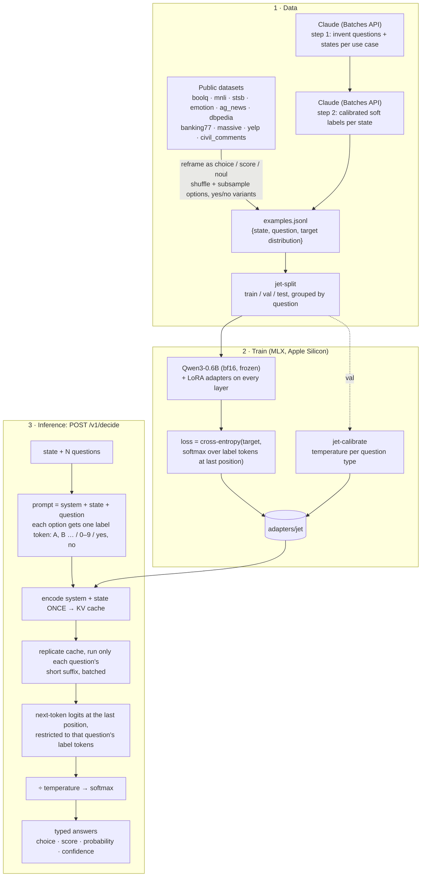

# jet

Train and serve your own small decision model, a local take on [Jev](https://jevtypesafeai.com/).
You send a **state** plus named, typed **questions** and get back calibrated, typed
answers. There's no text generation, so nothing to parse and nothing to hallucinate.

| type     | criteria                     | answer                                                     |
| -------- | ---------------------------- | ---------------------------------------------------------- |
| `choice` | `{key: description}`, 2–255  | `choice` (a key), `probabilities` per key, `confidence`    |
| `score`  | `[level, …]`, 2–10, low→high | fractional `score`, argmax `level`, `probabilities`        |
| `noul`   | none                         | `probability` that the answer is yes                       |

## How it works



The key trick is that a decision is **one forward pass with no sampling**. Each option is mapped
to a single token (`A`…`Z`, then single-token pairs like `AB`; `0`–`9` for score levels; `yes`/`no`),
and the answer is the model's next-token distribution over just those tokens. The output can't
fall outside the answer type. Training teaches the model to put the right probability mass on those
tokens, and temperature scaling on held-out data makes the probabilities calibrated.

When several questions share a state, the state is encoded once. On an M2 Pro, 10 questions
about a ~640-token state take ~370 ms in total, versus ~1.8 s asking them one at a time.

## Setup

```sh
uv sync                  # Apple Silicon (Metal)
uv sync --extra cuda     # Linux with an NVIDIA GPU (CUDA 12)
```

The base model (`mlx-community/Qwen3-0.6B-bf16`) downloads on first use.

## Pipeline

```sh
# 1. data
uv run jet-data-public                         # → data/public.jsonl (~32k examples)
uv run jet-data-score-eval                     # → data/score_eval.jsonl, ordinal eval from held-out splits
uv run jet-distill tasks --n 300               # Claude invents 300 questions × 12 states (asks before spending)
uv run jet-distill label                       # Claude soft-labels each state → data/distill.jsonl
uv run jet-split data/public.jsonl data/distill.jsonl --holdout-source emotion
#    val.jsonl, test.jsonl and score_eval.jsonl are committed; to compare models, keep them and grow
#    train instead of re-splitting. e.g. train_v2 = train + varied-scale score questions:
uv run jet-data-public --only stsb_scales yelp_scales civil_scores --seed 1 --out data/public_scores.jsonl
uv run jet-extend data/train.jsonl data/public_scores.jsonl \
    --exclude data/val.jsonl data/test.jsonl data/score_eval.jsonl --out data/train_v2.jsonl

# 2. train + calibrate
uv run jet-train                               # → adapters/jet (best checkpoint by val NLL)
#    score questions add a ranked-probability term to the loss (--ordinal-weight, default 2; 0 = off)
#    interrupted? continue from the last saved checkpoint (restores optimizer state too):
#    uv run jet-train --resume adapters/jet
uv run jet-calibrate --adapter adapters/jet
uv run jet-fuse                                # merge LoRA into the weights → models/jet (~18% faster, same accuracy)

# 3. measure: accuracy, NLL, Brier, ECE per source and type, plus latency
uv run jet-eval --data data/test.jsonl                            # untrained baseline
uv run jet-eval --adapter adapters/jet --data data/test.jsonl
uv run jet-eval --adapter adapters/jet --data data/score_eval.jsonl   # adds mae / ±1 / Spearman for score questions

# 4. serve
JET_API_KEY=secret uv run jet-serve --base-model models/jet

# optional: head-to-head against the hosted Jev API (needs a Jev key; ~$0.20 for 1,500 rows)
JEV_API_KEY=jv_live_... uv run jet-bench-jev --data data/test.jsonl --limit 1500
```

`jet-distill` needs Anthropic credentials (`ANTHROPIC_API_KEY` or `ant auth login`). It uses
`claude-opus-5` through the Message Batches API at 50% of the normal price, and it resumes from
`data/distill/batches.json` instead of resubmitting. Batches can't use server-side refusal
fallbacks, so any refused items are dropped.

## Results

Jet trained on the public data only (no Claude distillation yet): 2 epochs, 2,378 steps, best checkpoint at
step 2,250 by validation NLL, then calibrated and fused. The test set has 1,500 rows. `emotion` makes up two-thirds of them
and is held out of training entirely, so it measures transfer to a task the model never saw.

| model                   | accuracy | NLL  | Brier | ECE   | trained tasks acc | held-out `emotion` acc | 1 question |
| ----------------------- | -------- | ---- | ----- | ----- | ----------------- | ---------------------- | ---------- |
| Qwen3-0.6B, untrained   | 46.6%    | 2.66 | 0.886 | 0.428 | 44.6%             | 47.6%                  | 82 ms      |
| Jet step 1,000          | 65.8%    | 0.92 | 0.462 | 0.101 | 79.9%             | 58.8%                  | 59 ms      |
| **Jet final (fused)**   | **66.7%**| **0.86** | **0.441** | **0.079** | **82.7%**   | 58.7%                  | **59 ms**  |

Per source (final): massive 100%, dbpedia 97%, ag_news 92%, banking77 89%, civil_comments 88%, boolq 82%,
mnli 82%, yelp 71%, emotion (held out) 59%, stsb 45%. Latency is for one question on an M2 Pro. Ten questions
about one ~640-token state take about 500 ms together, because the state is encoded once.

The second epoch helped the trained tasks (79.9% → 82.7%) but not the unseen one (58.8% → 58.7%). More
varied training tasks, such as the Claude-distilled set, are the likely lever for generalization.
Jet has not been benchmarked against the hosted Jev API yet; `jet-bench-jev` does that.

## API

```sh
curl localhost:8000/v1/decide \
  -H "Authorization: Bearer secret" -H "Content-Type: application/json" \
  -d '{
    "state": "I was charged twice this month and nobody answers my emails.",
    "questions": {
      "topic":    {"type": "choice", "instructions": "What is the primary issue?",
                   "criteria": {"billing": "billing or payment problem", "bug": "the product is broken"}},
      "severity": {"type": "score", "instructions": "How urgent is this?",
                   "criteria": ["routine", "handle today", "urgent", "critical, about to churn"]},
      "escalate": {"type": "noul", "instructions": "Escalate to a human immediately?"}
    }
  }'
```

```json
{
  "model": "jet-local-0.1",
  "answers": {
    "topic":    {"type": "choice", "choice": "billing", "probabilities": {"billing": 0.97, "bug": 0.03}, "confidence": 0.8},
    "severity": {"type": "score", "score": 2.1, "level": "urgent", "probabilities": [0.05, 0.15, 0.45, 0.35], "confidence": 0.2},
    "escalate": {"type": "noul", "probability": 0.81, "confidence": 0.3}
  },
  "usage": {"input_tokens": 316},
  "latency_ms": 102.0
}
```

The numbers above are illustrative. `confidence` is `1 − normalized entropy` of the answer
distribution. States longer than 4096 tokens are truncated in the middle. Errors: `400` invalid
request, `401` bad API key.

## Layout

```
src/jet/
  format.py        prompt format + label tokens (shared by training and inference)
  model.py         Jet: forward pass, shared-state KV prefix, typed answers
  train.py         LoRA training loop (label-token cross-entropy)
  evaluate.py      jet-eval / jet-calibrate
  server.py        FastAPI /v1/decide
  fuse.py          merge LoRA into the base weights for serving
  bench_jev.py     score the hosted Jev API on the same test set
  data/public.py   public dataset builders
  data/distill.py  Claude distillation (Batches API)
  data/split.py    merge, dedupe, grouped split
```
