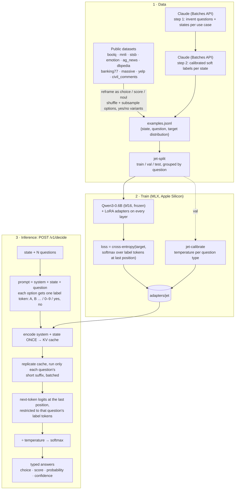

# jet

Train and serve your own small decision model, a local take on [Jev](https://jevtypesafeai.com/).
You send a **state** plus named, typed **questions** and get back calibrated, typed
answers. There's no text generation, so nothing to parse and nothing to hallucinate.

| type     | criteria                     | answer                                                     |
| -------- | ---------------------------- | ---------------------------------------------------------- |
| `choice` | `{key: description}`, 2–255  | `choice` (a key), `probabilities` per key, `confidence`    |
| `score`  | `[level, …]`, 2–10, low→high | fractional `score`, argmax `level`, `probabilities`        |
| `noul`   | none                         | `probability` that the answer is yes                       |

## How it works



The key trick is that a decision is **one forward pass with no sampling**. Each option is mapped
to a single token (`A`…`Z`, then single-token pairs like `AB`; `0`–`9` for score levels; `yes`/`no`),
and the answer is the model's next-token distribution over just those tokens. The output can't
fall outside the answer type. Training teaches the model to put the right probability mass on those
tokens, and temperature scaling on held-out data makes the probabilities calibrated.

When several questions share a state, the state is encoded once. On an M2 Pro, 10 questions
about a ~640-token state take ~370 ms in total, versus ~1.8 s asking them one at a time.

## Setup

```sh
uv sync                  # Apple Silicon (Metal)
uv sync --extra cuda     # Linux with an NVIDIA GPU (CUDA 12)
./train_cuda.sh --train data/train_v2.jsonl   # on Linux, run jet-train through this (sets up CUDA headers)
```

The base model (`mlx-community/Qwen3-0.6B-bf16`) downloads on first use.

## Pipeline

```sh
# 1. data
uv run jet-data-public                         # → data/public.jsonl (~32k examples)
uv run jet-data-score-eval                     # → data/score_eval.jsonl, ordinal eval from held-out splits
uv run jet-distill tasks --n 300               # Claude invents 300 questions × 12 states (asks before spending)
uv run jet-distill label                       # Claude soft-labels each state → data/distill.jsonl
uv run jet-split data/public.jsonl data/distill.jsonl --holdout-source emotion
#    val.jsonl, test.jsonl and score_eval.jsonl are committed; to compare models, keep them and grow
#    train instead of re-splitting. e.g. train_v2 = train + varied-scale score questions:
uv run jet-data-public --only stsb_scales yelp_scales civil_scores --seed 1 --out data/public_scores.jsonl
uv run jet-extend data/train.jsonl data/public_scores.jsonl \
    --exclude data/val.jsonl data/test.jsonl data/score_eval.jsonl --out data/train_v2.jsonl

# 2. train + calibrate
uv run jet-train                               # → adapters/jet (best checkpoint by val NLL)
#    score questions add a ranked-probability term to the loss (--ordinal-weight, default 2; 0 = off)
#    interrupted? continue from the last saved checkpoint (restores optimizer state too):
#    uv run jet-train --resume adapters/jet
uv run jet-calibrate --adapter adapters/jet
uv run jet-fuse                                # merge LoRA into the weights → models/jet (~18% faster, same accuracy)

# 3. measure: accuracy, NLL, Brier, ECE per source and type, plus latency
uv run jet-eval --data data/test.jsonl                            # untrained baseline
uv run jet-eval --adapter adapters/jet --data data/test.jsonl
uv run jet-eval --adapter adapters/jet --data data/score_eval.jsonl   # adds mae / ±1 / Spearman for score questions
#    on a 16 GB NVIDIA card, pass --batch-size 4 to jet-calibrate / jet-eval (the default 16 runs out of memory)

# 4. serve (--cors-origin lets the demo site at https://jach.me call it from the browser)
JET_API_KEY=secret uv run jet-serve --base-model models/jet --cors-origin https://jach.me

# optional: head-to-head against the hosted Jev API (needs a Jev key; ~$0.20 for 1,500 rows)
JEV_API_KEY=jv_live_... uv run jet-bench-jev --data data/test.jsonl --limit 1500
```

`jet-distill` needs Anthropic credentials (`ANTHROPIC_API_KEY` or `ant auth login`). It uses
`claude-opus-5` through the Message Batches API at 50% of the normal price, and it resumes from
`data/distill/batches.json` instead of resubmitting. Batches can't use server-side refusal
fallbacks, so any refused items are dropped.

With `--backend claude-code`, `jet-distill` instead runs one headless `claude -p` call per request
on your Claude Code subscription (no API key; it counts against your plan's usage limits):

```sh
uv run jet-distill --backend claude-code tasks --n 300    # --model opus, --effort medium, --workers 4
uv run jet-distill --backend claude-code label
```

Each result is saved to `data/distill/claude_code/<step>/` as it arrives, so if a run hits the usage
limit it stops, and re-running the same command picks up where it left off.

## Latest training candidate

V4 keeps Qwen3-0.6B and improves several language and relevance diagnostics while
regressing on code behavior and the original test set. These partial rebuilt
benchmarks do not establish a Decision Index leaderboard score. See the
[training report](docs/training/jet-next/summary.md) and
[release export notes](docs/training/jet-v4-release.md).

## Results

The released model is `jet` (`adapters/jet`, `models/jet`, and [michaljach/jet](https://huggingface.co/michaljach/jet)
on Hugging Face). It is Qwen3-0.6B trained on `train_v2` (public data plus varied-scale score questions,
no Claude distillation yet) on an RTX 4080: 2 epochs, 2,910 steps, best checkpoint at step 2,750 by
validation NLL (0.485), then calibrated and fused. A Qwen3-1.7B variant was trained the same way for
comparison (best at step 2,500, val NLL 0.420) and not kept: `jet` is better calibrated and about 1.8×
faster, for half a point of accuracy. The test set has 3,683 rows. `emotion` makes up two-thirds of them
and is held out of training entirely, so it measures transfer to a task the model never saw.

| model                     | accuracy  | NLL      | Brier     | ECE       | trained tasks acc | held-out `emotion` acc | ms / question |
| ------------------------- | --------- | -------- | --------- | --------- | ----------------- | ---------------------- | ------------- |
| Qwen3-0.6B, untrained     | 46.7%     | 2.63     | 0.885     | 0.428     | 46.6%             | 46.7%                  | 6.1           |
| **jet** (0.6B, fused)     | 67.7%     | 0.87     | **0.427** | **0.061** | 83.2%             | 60.3%                  | **6.1**       |
| Qwen3-1.7B, untrained     | 60.5%     | 5.67     | 0.741     | 0.375     | 62.1%             | 59.8%                  | 11.1          |
| 1.7B variant (fused)      | **68.2%** | **0.86** | 0.430     | 0.100     | **83.8%**         | **60.9%**              | 11.1          |

Latency is batched eval time (batch size 4) on the 4080. Per source, `jet`: dbpedia 99%, civil_comments 92%,
massive 92%, banking77 89%, ag_news 88%, mnli 82%, boolq 81%, yelp 72%, emotion (held out) 60%, stsb 56%.
By type: noul 79%, choice 62%, score 61%.

The larger base model learns the trained tasks better: test NLL drops on 8 of 9 of them (mnli 0.48 → 0.36,
massive 0.33 → 0.18, yelp 0.69 → 0.58), and on its in-distribution validation data it needs almost no
temperature correction (T 1.00–1.09, against 1.03–1.30 for `jet`). It does not transfer better. Untrained
Qwen3-1.7B already reaches 59.8% on `emotion` zero-shot and training only takes it to 60.9%, while it becomes
more overconfident there (ECE 0.095 → 0.144). The temperatures are fit on trained tasks, so they can't correct
that, and it is why the 1.7B variant's overall ECE is worse. Varied training tasks, such as the
Claude-distilled set, still look like the lever for generalization, not model size.

On the ordinal set (`score_eval.jsonl`, 2,400 score questions from held-out splits):

| model        | exact level | within one level | Spearman | ECE   | Spearman per source (stsb / yelp / amazon / sst5) |
| ------------ | ----------- | ---------------- | -------- | ----- | ------------------------------------------------- |
| `jet`        | 52.1%       | 91.4%            | 0.83     | 0.035 | 0.90 / 0.89 / 0.79 / 0.74                          |
| 1.7B variant | 53.9%       | 93.5%            | 0.86     | 0.071 | 0.93 / 0.91 / 0.83 / 0.79                          |

Fusing leaves the metrics unchanged (`jet` test accuracy 67.6% → 67.7%, 1.7B variant 68.0% → 68.2%) and
cuts batched eval time by about a third (`jet` 9.1 → 6.1 ms, 1.7B variant 16.5 → 11.1 ms per question).

### Against Kev and Jev, on Kev's out-of-domain suite


[Kev](https://github.com/jaredpalmer/kev) publishes a frozen out-of-domain suite (`transfer-v4`, 656 clean rows,
11 sources) and per-source numbers for its family and for Jev. `jet-bench-kev` converts those rows to jet's format
and scores them. `jet` gets **54.9%** (Brier 0.622), up from 51.7% for untrained Qwen3-0.6B. That is below
Kev-0.8B (65.2%) and the Kev-0.5B prototype (56.1%), and far below Kev-4B/9B (≈80%) and Jev (85.7%). It holds up
on sources that look like its training mix (SciQ 90%, QNLI 76%, TweetEval 72%) and is at or below chance on
everything else. On the policy, rule and PAWS rows it mostly picks the same answer for every row (always "yes" on
authorization and PAWS, always "late but accepted" on deadline). MMLU is at chance (29%). jet has never trained on
rule-following or knowledge questions. Kev's policy and rule families are exactly the varied tasks that
distillation is meant to add.

```sh
uv run jet-bench-kev --base-model michaljach/jet --name jet      # → docs/bench/kev-transfer-v4/jet.json
uv run jet-bench-kev --name qwen3-0.6b-untrained                 # untrained baseline
uv sync --extra plot && uv run jet-plot-kev                       # → docs/jet-vs-kev.png
```

### Earlier run (1,500-row test split)

Before the held-out sets were versioned: public data only, 2 epochs, 2,378 steps, best checkpoint at step
2,250. These rows come from a different split, so compare them with each other, not with the table above.

| model                   | accuracy | NLL  | Brier | ECE   | trained tasks acc | held-out `emotion` acc | 1 question |
| ----------------------- | -------- | ---- | ----- | ----- | ----------------- | ---------------------- | ---------- |
| Qwen3-0.6B, untrained   | 46.6%    | 2.66 | 0.886 | 0.428 | 44.6%             | 47.6%                  | 82 ms      |
| Jet step 1,000          | 65.8%    | 0.92 | 0.462 | 0.101 | 79.9%             | 58.8%                  | 59 ms      |
| Jet final (fused)       | 66.7%    | 0.86 | 0.441 | 0.079 | 82.7%             | 58.7%                  | 59 ms      |

Latency is for one question on an M2 Pro. Ten questions about one ~640-token state take about 500 ms
together, because the state is encoded once.

The second epoch helped the trained tasks (79.9% → 82.7%) but not the unseen one (58.8% → 58.7%). More
varied training tasks, such as the Claude-distilled set, are the likely lever for generalization.
Jet has not been benchmarked against the hosted Jev API yet; `jet-bench-jev` does that.

## API

For Decision Index evaluation, see [the baseline and CUDA handoff guide](docs/decision-index.md).
`uv sync --extra benchmark` installs the pinned official harness;
`jet-bench-index` prepares diagnostic samples, audits full prompt capacity, and
reports results. The benchmark adapter preserves complete inputs and rejects
over-capacity requests instead of using the serving API's state truncation.

```sh
curl localhost:8000/v1/decide \
  -H "Authorization: Bearer secret" -H "Content-Type: application/json" \
  -d '{
    "state": "I was charged twice this month and nobody answers my emails.",
    "questions": {
      "topic":    {"type": "choice", "instructions": "What is the primary issue?",
                   "criteria": {"billing": "billing or payment problem", "bug": "the product is broken"}},
      "severity": {"type": "score", "instructions": "How urgent is this?",
                   "criteria": ["routine", "handle today", "urgent", "critical, about to churn"]},
      "escalate": {"type": "noul", "instructions": "Escalate to a human immediately?"}
    }
  }'
```

```json
{
  "model": "jet-local-0.1",
  "answers": {
    "topic":    {"type": "choice", "choice": "billing", "probabilities": {"billing": 0.97, "bug": 0.03}, "confidence": 0.8},
    "severity": {"type": "score", "score": 2.1, "level": "urgent", "probabilities": [0.05, 0.15, 0.45, 0.35], "confidence": 0.2},
    "escalate": {"type": "noul", "probability": 0.81, "confidence": 0.3}
  },
  "usage": {"input_tokens": 316},
  "latency_ms": 102.0
}
```

The numbers above are illustrative. `confidence` is `1 − normalized entropy` of the answer
distribution. States longer than 4096 tokens are truncated in the middle. Errors: `400` invalid
request, `401` bad API key.

## In the browser

[jach-labs.github.io](https://jach-labs.github.io) runs jet in the visitor's browser with onnxruntime-web
(`jet.js` there is a JavaScript port of `format.py` and `model.py`). It uses `onnx/model_q8.onnx` from
[jach-labs/jet](https://huggingface.co/jach-labs/jet): 8-bit weights, 791 MB, the same answer as the bf16
model on every golden case with probabilities within 0.034. To rebuild it after training a new model:

```sh
uv run jet-golden --base-model models/jet --out models/jet/golden.json   # reference vectors for the port
./export_web.sh models/jet                                              # -> models/jet/onnx/model_q8.onnx, then checked
```

`export_web.sh` needs Linux, an NVIDIA GPU and systemd. It sets up its own environment (torch, optimum) in
`~/.cache/jet-web-build`, exports on the GPU and caps each step's memory. `src/onnx_web.py` explains the
choice of quantization. Upload `onnx/model_q8.onnx` and `golden.json` to the Hugging Face repo next to the
weights. The site's `test.html` then checks the browser port against the same vectors.

## Layout

```
src/
  format.py        prompt format + label tokens (shared by training and inference)
  model.py         Jet: forward pass, shared-state KV prefix, typed answers
  train.py         LoRA training loop (label-token cross-entropy)
  evaluate.py      jet-eval / jet-calibrate
  server.py        FastAPI /v1/decide
  fuse.py          merge LoRA into the base weights for serving
  bench_jev.py     score the hosted Jev API on the same test set
  bench_kev.py     score jet on Kev's transfer-v4 suite and plot it next to Kev and Jev
  golden.py        jet-golden: test vectors for ports to other runtimes
  onnx_web.py      browser model: slice, quantize and check the ONNX export (export_web.sh)
  data/public.py   public dataset builders
  data/distill.py  Claude distillation (Batches API)
  data/split.py    merge, dedupe, grouped split
```

## Hugging Face deployment

The [Jet Space](https://huggingface.co/spaces/michaljach/jet) shows the deployment
status and includes the tested CPU API source. Browser inference has been
removed. Hosted inference is currently blocked by Hugging Face account-plan
requirements. See [deployment instructions](deploy/huggingface/README.md).
