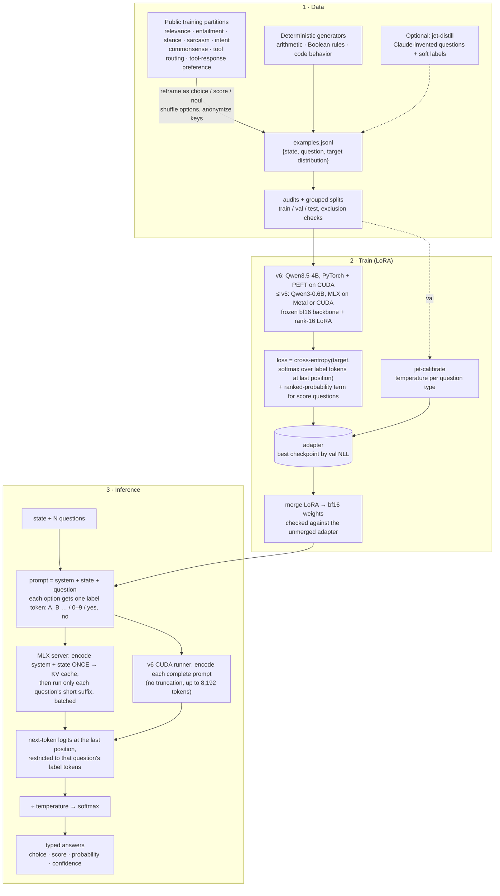

# Jet

Jet is a typed decision model built on **Qwen3.5-4B** (v6). Give it a state and named,
typed questions; it returns choices, scores, and probabilities without generating
free-form text. Answers always follow the requested type, but decisions can still
be wrong.

[Model weights](https://huggingface.co/michaljach/jet) ·
[Hugging Face demo](https://huggingface.co/spaces/michaljach/jet) ·
[Training history](TRAINING_HISTORY.md)

| Type | Criteria | Answer |
|---|---|---|
| `choice` | 2–255 named options | Selected key, probability per key, confidence |
| `score` | 2–10 ordered levels | Fractional score, selected level, probabilities |
| `noul` | None | Probability that the answer is yes |

## Run locally

**Jet v6 (Linux + NVIDIA CUDA).** The Hugging Face release is self-contained: it
ships the merged bf16 weights with the runtime from [`releases/jet-v6/`](releases/jet-v6/) and
`src/format.py` / `src/inference.py`.

```sh
hf download michaljach/jet --revision e5b8f610ddb92ffaba596ae452bed32a9fef49ca --local-dir jet
cd jet
python -m pip install -r requirements.txt
echo '{"state":"I was charged twice this month.","questions":{"billing":{"type":"noul","instructions":"Is this a billing issue?"}}}' | python jet.py
```

**MLX server (Apple Silicon, or Linux via MLX CUDA).** The HTTP server and the
training pipeline in this repository run the earlier Qwen3-0.6B releases. The last
one is kept in the model repository's history at revision `25ccbd9e`:

```sh
git clone https://github.com/michaljach/jet
cd jet
uv sync                  # Apple Silicon / Metal
# Linux with NVIDIA: uv sync --extra cuda
hf download michaljach/jet --revision 25ccbd9e09c75643b3c2214e2b2522bec39171a7 --local-dir models/jet-0.6b
JET_API_KEY=secret uv run jet-serve --base-model models/jet-0.6b
```

```sh
curl http://localhost:8000/v1/decide \
  -H 'Authorization: Bearer secret' \
  -H 'Content-Type: application/json' \
  -d '{"state":"I was charged twice this month.","questions":{"topic":{"type":"choice","instructions":"What is the primary issue?","criteria":{"billing":"billing or payment problem","bug":"the product is broken"}},"escalate":{"type":"noul","instructions":"Does this require human support?"}}}'
```

The model requires Jet's prompt format and label-token readout. It is not a chat
model. The MLX server shares the state prefix across questions, applies the saved
calibration temperatures, and returns typed answers. Serving truncates long states
in the middle; the Decision Index adapter instead requires complete inputs.

## How it works



Each answer option maps to a single token. Jet reads the next-token logits only
for those labels and applies softmax with a temperature fitted on held-out data.
Standard serving uses one forward pass per question, without sampling.
The fused bf16 weights include the trained LoRA updates.

The benchmark package also provides `decision_index_ensemble:TwoOrderJetEngine`.
It averages original and reversed option-order probabilities using exact option
keys. This approximately doubles forward-pass work and is separate from the
standard serving API.

## Training and evaluation

Jet v6 (checkpoint step 3,750, released 2026-09-24) fine-tuned Qwen3.5-4B with a
fresh rank-16 LoRA on the same 15,997-example `train_v5_r2` mixture as v5: public
training partitions and deterministic generators covering relevance, entailment,
stance, sarcasm, routing, arithmetic, Boolean rules, code behavior, commonsense
completion and tool-response preference. One epoch (4,000 optimizer updates,
learning rate `1e-4`) took about 2 h 26 min on one RTX 4080 SUPER. The step was
selected by NLL on a 1,400-row selection split; calibration used a separate
1,400-row split.

| Evaluation | Result |
|---|---:|
| Selection accuracy (1,400 rows) | 87.93% |
| Independent local test accuracy (600 rows) | 94.00% |
| Sampled benchmark requests, errors | 1,900 across 15 datasets, 0 errors |
| Official Decision Index | Not measured |

These are local measurements on the unmerged adapter, not a Decision Index score.
Source overlap inherited from v5's data has not been comprehensively ruled out.
Details: [v6 release notes](docs/training/jet-v6-release.md) and the
[model card](releases/jet-v6/README.md). Earlier versions are in the
[training history](TRAINING_HISTORY.md).

The v6 PyTorch/PEFT pipeline is recorded in
[`experiments/jet-4b-full-20260924/`](experiments/jet-4b-full-20260924/).
The continued-training candidate and checkpoint resume support are in
[`experiments/jet-targeted-20260924/`](experiments/jet-targeted-20260924/).
The MLX pipeline below reproduces the Qwen3-0.6B releases (v5 and earlier), following
the [recorded v5 protocol](docs/training/jet-v5/protocol.md) and scripts under `scripts/`.

```sh
# CUDA launcher prepares the MLX CUDA environment.
./train_cuda.sh --help
uv run jet-calibrate --adapter /path/to/adapter --data /path/to/calibration.jsonl
uv run jet-fuse --adapter /path/to/adapter --out models/jet
uv run jet-eval --base-model models/jet --data data/test.jsonl
```

Optional `jet-distill` data generation uses Anthropic credentials or the
`--backend claude-code` mode. It is not required for serving or reproducing the
public-source training pipeline; hosted generation can incur charges.

## Deployment

The Hugging Face model repository holds v6: merged bf16 weights (nine shards,
8.4 GB), tokenizer, calibration, the CUDA runtime, and provenance and validation
records. Everything except the weights and tokenizer is kept in
[`releases/jet-v6/`](releases/jet-v6/); `scripts/publish_release.py` uploads it.
The Space code serves the last Qwen3-0.6B release (V5, revision `25ccbd9e`) and exposes
`/decide`; its availability depends on Hugging Face's free hosting quota. See
[deployment instructions](deploy/huggingface/README.md).

To cut a new release from a Qwen3.5-4B adapter (Linux + CUDA), merge it into the
release folder, check it against the adapter's saved logits, then publish:

```sh
uv run python scripts/merge_release.py --adapter adapters/<run>/best --step <step>
uv run python scripts/validate_release.py --case <rows.jsonl> <adapter-logits.json>
uv run python scripts/publish_release.py --version v6.x.y --dry-run   # then without --dry-run
```

The ONNX/browser build exists for the Qwen3-0.6B releases only (revision `25ccbd9e`
contains the V5 `onnx/model_q8.onnx`). It supports CPU and browser runtimes through ONNX Runtime.
`jet-golden` generates reference cases, and `export_web.sh` exports and checks
the browser model. Export validation is recorded with the model package;
quantization can change probabilities.

## Project layout

- `src/format.py`, `src/inference.py`: prompts and typed answers
- `src/model.py`, `src/torch_model.py`, `src/onnx_model.py`: inference backends
- `src/train.py`, `src/evaluate.py`, `src/fuse.py`: training, calibration, evaluation and fusion
- `src/data/`, `scripts/`: data builders and reproducible experiments
- `src/decision_index_engine.py`, `src/decision_index_ensemble.py`: benchmark adapters
- `releases/jet-v6/`: v6 model card, CUDA runtime and release records published with the Hugging Face weights
- `deploy/huggingface/`: hosted demo and API deployment
