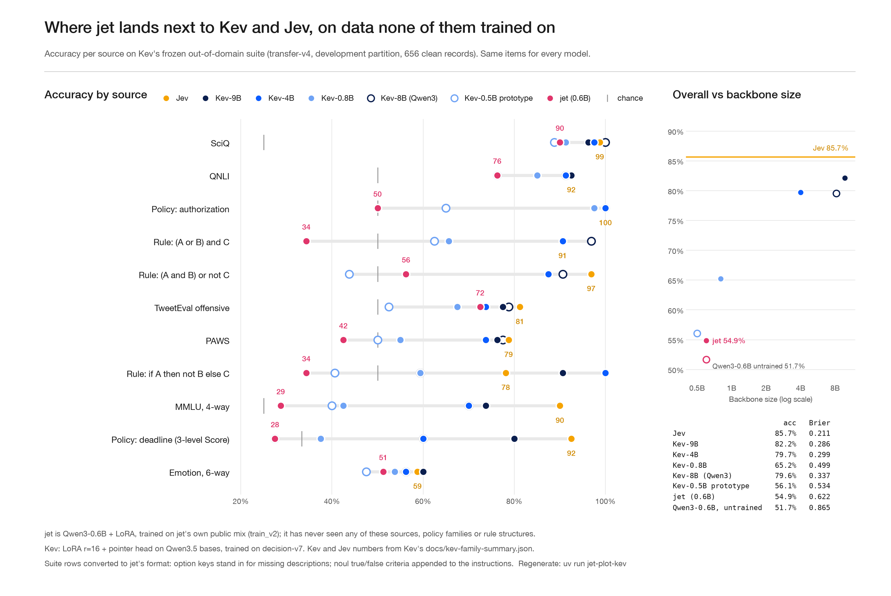

# Initial training results


The released model is `jet` (`adapters/jet`, `models/jet`, and [michaljach/jet](https://huggingface.co/michaljach/jet)
on Hugging Face). It is Qwen3-0.6B trained on `train_v2` (public data plus varied-scale score questions,
no Claude distillation yet) on an RTX 4080: 2 epochs, 2,910 steps, best checkpoint at step 2,750 by
validation NLL (0.485), then calibrated and fused. A Qwen3-1.7B variant was trained the same way for
comparison (best at step 2,500, val NLL 0.420) and not kept: `jet` is better calibrated and about 1.8×
faster, for half a point of accuracy. The test set has 3,683 rows. `emotion` makes up two-thirds of them
and is held out of training entirely, so it measures transfer to a task the model never saw.

| model                     | accuracy  | NLL      | Brier     | ECE       | trained tasks acc | held-out `emotion` acc | ms / question |
| ------------------------- | --------- | -------- | --------- | --------- | ----------------- | ---------------------- | ------------- |
| Qwen3-0.6B, untrained     | 46.7%     | 2.63     | 0.885     | 0.428     | 46.6%             | 46.7%                  | 6.1           |
| **jet** (0.6B, fused)     | 67.7%     | 0.87     | **0.427** | **0.061** | 83.2%             | 60.3%                  | **6.1**       |
| Qwen3-1.7B, untrained     | 60.5%     | 5.67     | 0.741     | 0.375     | 62.1%             | 59.8%                  | 11.1          |
| 1.7B variant (fused)      | **68.2%** | **0.86** | 0.430     | 0.100     | **83.8%**         | **60.9%**              | 11.1          |

Latency is batched eval time (batch size 4) on the 4080. Per source, `jet`: dbpedia 99%, civil_comments 92%,
massive 92%, banking77 89%, ag_news 88%, mnli 82%, boolq 81%, yelp 72%, emotion (held out) 60%, stsb 56%.
By type: noul 79%, choice 62%, score 61%.

The larger base model learns the trained tasks better: test NLL drops on 8 of 9 of them (mnli 0.48 → 0.36,
massive 0.33 → 0.18, yelp 0.69 → 0.58), and on its in-distribution validation data it needs almost no
temperature correction (T 1.00–1.09, against 1.03–1.30 for `jet`). It does not transfer better. Untrained
Qwen3-1.7B already reaches 59.8% on `emotion` zero-shot and training only takes it to 60.9%, while it becomes
more overconfident there (ECE 0.095 → 0.144). The temperatures are fit on trained tasks, so they can't correct
that, and it is why the 1.7B variant's overall ECE is worse. Varied training tasks, such as the
Claude-distilled set, still look like the lever for generalization, not model size.

On the ordinal set (`score_eval.jsonl`, 2,400 score questions from held-out splits):

| model        | exact level | within one level | Spearman | ECE   | Spearman per source (stsb / yelp / amazon / sst5) |
| ------------ | ----------- | ---------------- | -------- | ----- | ------------------------------------------------- |
| `jet`        | 52.1%       | 91.4%            | 0.83     | 0.035 | 0.90 / 0.89 / 0.79 / 0.74                          |
| 1.7B variant | 53.9%       | 93.5%            | 0.86     | 0.071 | 0.93 / 0.91 / 0.83 / 0.79                          |

Fusing leaves the metrics unchanged (`jet` test accuracy 67.6% → 67.7%, 1.7B variant 68.0% → 68.2%) and
cuts batched eval time by about a third (`jet` 9.1 → 6.1 ms, 1.7B variant 16.5 → 11.1 ms per question).

### Against Kev and Jev, on Kev's out-of-domain suite



[Kev](https://github.com/jaredpalmer/kev) publishes a frozen out-of-domain suite (`transfer-v4`, 656 clean rows,
11 sources) and per-source numbers for its family and for Jev. `jet-bench-kev` converts those rows to jet's format
and scores them. `jet` gets **54.9%** (Brier 0.622), up from 51.7% for untrained Qwen3-0.6B. That is below
Kev-0.8B (65.2%) and the Kev-0.5B prototype (56.1%), and far below Kev-4B/9B (≈80%) and Jev (85.7%). It holds up
on sources that look like its training mix (SciQ 90%, QNLI 76%, TweetEval 72%) and is at or below chance on
everything else. On the policy, rule and PAWS rows it mostly picks the same answer for every row (always "yes" on
authorization and PAWS, always "late but accepted" on deadline). MMLU is at chance (29%). jet has never trained on
rule-following or knowledge questions. Kev's policy and rule families are exactly the varied tasks that
distillation is meant to add.

```sh
uv run jet-bench-kev --base-model michaljach/jet --name jet      # → docs/bench/kev-transfer-v4/jet.json
uv run jet-bench-kev --name qwen3-0.6b-untrained                 # untrained baseline
uv sync --extra plot && uv run jet-plot-kev                       # → docs/jet-vs-kev.png
```

### Earlier run (1,500-row test split)

Before the held-out sets were versioned: public data only, 2 epochs, 2,378 steps, best checkpoint at step
2,250. These rows come from a different split, so compare them with each other, not with the table above.

| model                   | accuracy | NLL  | Brier | ECE   | trained tasks acc | held-out `emotion` acc | 1 question |
| ----------------------- | -------- | ---- | ----- | ----- | ----------------- | ---------------------- | ---------- |
| Qwen3-0.6B, untrained   | 46.6%    | 2.66 | 0.886 | 0.428 | 44.6%             | 47.6%                  | 82 ms      |
| Jet step 1,000          | 65.8%    | 0.92 | 0.462 | 0.101 | 79.9%             | 58.8%                  | 59 ms      |
| Jet final (fused)       | 66.7%    | 0.86 | 0.441 | 0.079 | 82.7%             | 58.7%                  | 59 ms      |

Latency is for one question on an M2 Pro. Ten questions about one ~640-token state take about 500 ms
together, because the state is encoded once.

The second epoch helped the trained tasks (79.9% → 82.7%) but not the unseen one (58.8% → 58.7%). More
varied training tasks, such as the Claude-distilled set, are the likely lever for generalization.
Jet has not been benchmarked against the hosted Jev API yet; `jet-bench-jev` does that.
